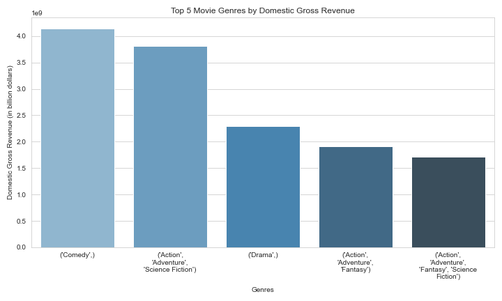
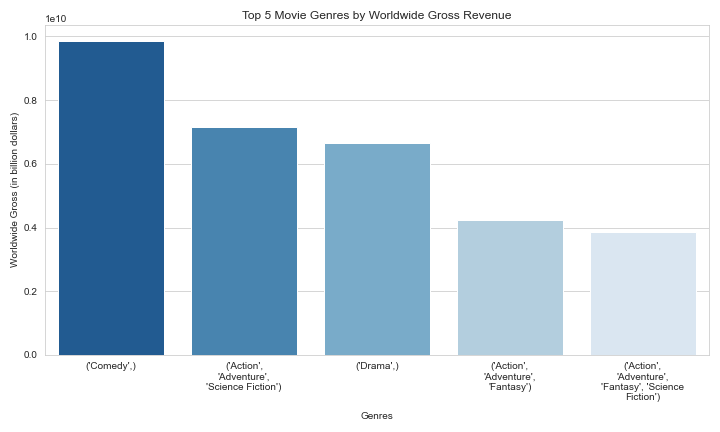
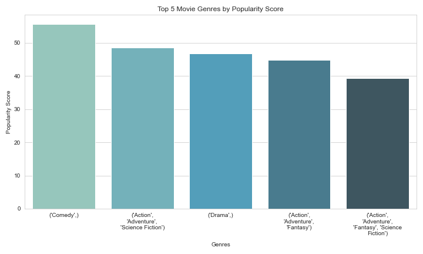
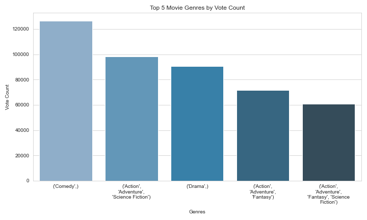
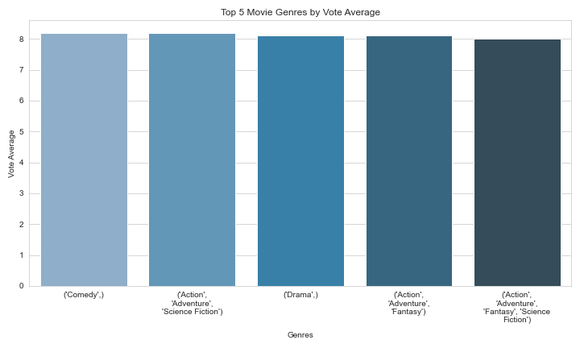
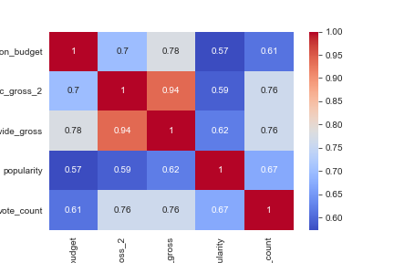
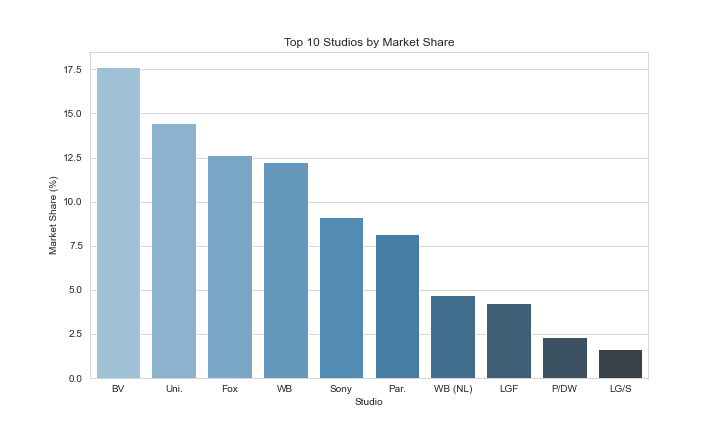
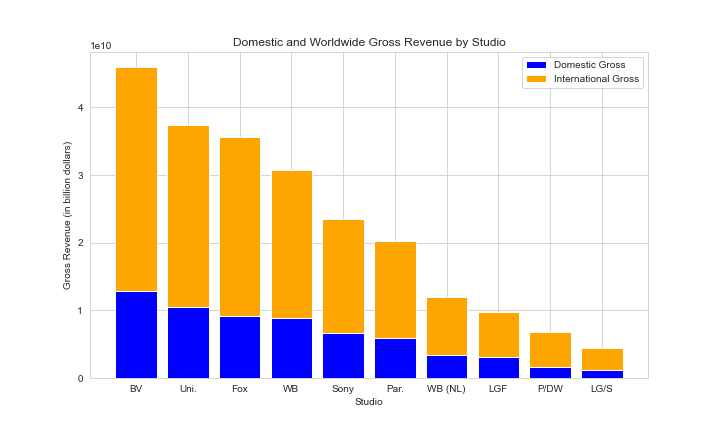
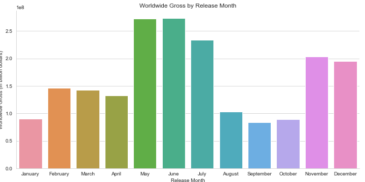
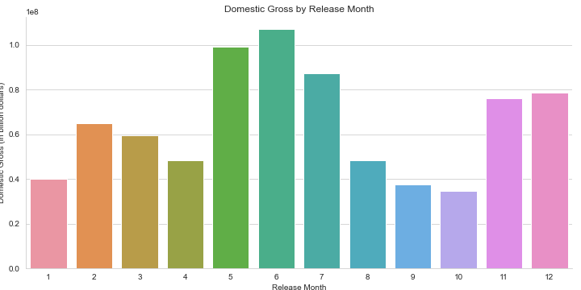

# Box Office Analysis: Identifying Best Performing Movie Genres for Microsoft's New Studio

## Overview
This project analyzes the datasets from 3 movie websites namely, [Box Office Mojo](https://www.boxofficemojo.com/) , [TheMovieDB](https://www.themoviedb.org/) and [The Numbers](https://www.the-numbers.com/). The 3 datasets are merged into one pandas DataFrame to enable a more indepth analysis and better findings with regards to the top/best performing movie genres in the Box Office. Microsoft can use the findings from this analysis to help decide what type of films to create so as to stay at par in the movie industry.

## Business Understanding
Based on the business problem, which is, Microsoft wants to get in on the fun of creating movies/original video content but they have no knowledge of creating movies, I have formulated 5 business questions whereby I will use my dataset to extract meaningful findings which can be translated into actionable insights for the Head of Microsoft's new movie studio to help him/her decide on what types of films to create. These business questions are:

1. What are the top 4 best performing genres of movies at the box office?

2. What is the relationship between production budget and the success of a movie both domestically and worldwide?

3. What is the competitive landscape of the movie industry in terms of market share?

4. How does the release time of a movie contribute to its success?

## Data Understanding 
The data sources for this analysis are 3 websites namely:
 - [Box Office Mojo](https://www.boxofficemojo.com/) 
 - [TheMovieDB](https://www.themoviedb.org/) 
 - [The Numbers](https://www.the-numbers.com/)

We therefore have 3 separate CSV data files:
 
 - `bom.movie_gross.csv.gz`: each record represents a movie title, with attributes of that movie (eg. `domestic_gross`).
 - `tmdb.movies.csv.gz`: each record represents a mvoie title as well, with attributes such as `release_date`.
 - `tn.movie_budgets.csv.gz`: each record represents a movie title as well, with attributes such as `production_budget`. 
 
Also, note that the data may not reflect the most-up-to-date trends and performances in the movie industry since its scope is upto 2019. 

## Performing Aggregations to answer Business Question no.1
The business question:
- What are the top 4 best performing types of movies at the box office?

Here I use the `groupby()` built-in method and group the dataset by the `genre_id` column to answer the question.

Also of importance to note is that some movies are a mixture of different genres.
So it begs the question, to either treat each genre ID individually or as a whole?
The answer to this question depends on the analysis being performed. If one is analyzing the popularity of each individual genre separately, then they would treat each ID individually. However, if one is analyzing the popularity of movies with a specific combination of genres, then they would treat the list of IDs as a whole.

That said, I will be treating the list of genres IDs as a whole, since a movie can be of one genre or also a combination of different genres.

To gain a better understanding of the current trends in the movie industry, it may be useful to explore multiple perspectives and consider how they relate to one another. I will compare the top genres across different groupings and look for patterns or similarities that may provide insight into overarching trends.

It's also important to keep in mind that the top genres by one metric may not necessarily be the same as the top genres by another metric. For example, a genre may be highly profitable but not very popular among audiences, or it may receive high ratings but not generate a lot of revenue. Therefore, it's important to consider multiple metrics when analyzing the data to get a more comprehensive understanding of the current trends in the movie industry.

To come up with a final top 4, I will consider the top genres across multiple metrics and determine which genres are consistently ranking high across the board. For instance, I will create plots that show the rankings for each genre by `domestic_gross_2`, `worldwide_gross`, `popularity`, `vote_count`, and `vote_average`, and then compare the results.

In addition, you can get the definitions of the various `genre_ids` values at [TheMovieDB `genre_ids` definitions](https://www.themoviedb.org/talk/5daf6eb0ae36680011d7e6ee)

Using the definitions of the various `genre_ids` values at [TheMovieDB `genre_ids` definitions](https://www.themoviedb.org/talk/5daf6eb0ae36680011d7e6ee); 

From the above results, the top 5 `genre_ids` sorted by `domestic_gross_2` are:
 1. [35] - which represents **Comedy** genre
 2. [28, 12, 878] - which represents a combination of **Action, Adventure & Science Fiction** genres
 3. [18] - which represents **Drama** genre
 4. [28, 12, 14] which represents a combination of **Action, Adventure & Fantasy** genres
 5. [28, 12, 14, 878] which represents a combination of **Action, Adventure, Fantasy & Science Fiction** genres
 

Using the definitions of the various `genre_ids` values provided at [TheMovieDB `genre_ids` definitions](https://www.themoviedb.org/talk/5daf6eb0ae36680011d7e6ee); 

From the above results, the top 5 `genre_ids` sorted by `worldwide_gross` are:
 1. [28, 12, 878] - which represents a combination of **Action, Adventure & Science Fiction** genres
 2. [35] - which represents **Comedy** genre
 3. [28, 12, 14] - which represents a combination of **Action, Adventure & Fantasy** genres
 4. [28, 12, 14, 878] - which represents a combination of **Action, Adventure, Fantasy & Science Fiction** genres
 5. [18] - which represents **Drama** genre

Using the definitions of the various `genre_ids` values provided at [TheMovieDB `genre_ids` definitions](https://www.themoviedb.org/talk/5daf6eb0ae36680011d7e6ee); 

From the above results, the top 5 `genre_ids` sorted by `popularity` are:
 1. [12, 28, 14] - which represents a combination of **Adventure, Action & Fantasy** genres
 2. [12] - which represents **Adventure** genre
 3. [28, 12, 878, 18] - which represents a combination of **Action, Adventure, Science Fiction & Drama** genres
 4. [28, 12, 878, 35] - which represents a combination of **Action, Adventure, Science Fiction & Comedy** genres
 5. [28, 12, 878, 14] - which represents a combination of **Action, Adventure, Science Fiction & Fantasy** genres

Using the definitions of the various `genre_ids` values provided at [TheMovieDB `genre_ids` definitions](https://www.themoviedb.org/talk/5daf6eb0ae36680011d7e6ee); 

From the above results, the top 5 `genre_ids` sorted by `vote_count` are:
 1. [28, 12, 878] - which represents a combination of **Action, Adventure & Science Fiction** genres
 2. [35] - which represents **Comedy** genre
 3. [18] - which represents **Drama** genre
 4. [28, 12, 14] - which represents a combination of **Action, Adventure & Fantasy** genres
 5. [28, 878, 12] - which represents a combination of **Action, Science Fiction & Adventure** genres

Using the definitions of the various `genre_ids` values provided at [TheMovieDB `genre_ids` definitions](https://www.themoviedb.org/talk/5daf6eb0ae36680011d7e6ee); 

From the above results, the top 4 `genre_ids` sorted by `vote_average` are:
 1. [16, 10751, 35, 12, 14] - which represents a combination of **Animation, Family, Comedy, Adventure & Fantasy** genres
 2. [18, 99] - which represents a combination of **Drama & Documentary** genres
 3. [36, 18, 53, 10752] - which represents a combination of **History, Drama, Thriller & War** genres
 4. [18, 36, 10752] - which represents a combination of **Drama, History & War** genres
 
 
- The correlation coefficient between `production_budget` and `worldwide_gross` is **0.78**; and between `production_budget` and `domestic_gross_2` is **0.7**. Both figures indicate a strong positive correlation between the variables. This means that as `production_budget` increases, `worldwide_gross` and `domestic_gross_2` tend to increase as well. Therefore, the production budget allocated to a movie production may be a good indicator of its success or failure in the Box Office.

 
 
The `market_share` is calculated as the sum of a studio's domestic revenue divided by the total domestic revenue of all the studios multiplied by 100%.
Based on the above analysis, BV Studio has the highest domestic and worldwide gross revenue, the highest total vote count, and the highest mean popularity. BV Studio has a market share of 17.6%, followed by Uni. with 14.5% and Fox with 12.7%. This suggests that BV Studio is the clear leader in many metrics. This provides insight into the competitive landscape of the movie industry based on the chosen metrics. 
 
 
The stacked bar plot shows the domestic and worldwide gross revenue of the top 10 movie studios, broken down by region,i.e.Domestic revenue and Worldwide reveneu. Each bar represents a studio, and is divided into two sections: blue for domestic gross revenue, and orange for worldwide gross revenue.

The height of each bar represents the total gross revenue for that studio, and the width of each section represents the proportion of that revenue coming from the domestic or worldwide market. For example, the tallest bar represents BV Studio, and we can see that the majority of its revenue comes from the international market.

 
 
The above plots show the average worldwide gross and domestic gross by release month for the movies in the dataset.
The x-axis shows the months of the year, and the y-axis shows the average gross in billion dollars. Each bar represents the average gross for a particular month.
The "Worldwide Gross by Release Month" plot shows that the months of May, June and July have the highest average worldwide gross, while the months of September and October have the lowest.
The "Domestic Gross by Release Month" plot show a similar trend, with May, June and July having the highest average domestic gross, and September and October having the lowest.
Overall, these plots suggest that releasing a movie in May, June or July may lead to higher gross revenue, both domestically and worldwide, while releasing a movie in September or October may result in lower gross revenue.

# Conclusion

This analysis leads to four **recommendations** that will enable Microsoft get into the movie industry with a resounding success for the movies that will be produced/created.

1. Based on the findings of the top 4 best performing types of movies in the Box Office, Microsoft can consider producing movies around the genre combinations of:
 - **Action, Adventure & Science Fiction** 
 - **Action, Adventure & Fantasy**
 - **Comedy** 
 - **Drama**
 
 Also, they can play around the genres creatively and come up with something a bit unique, for example, a combination of **Action, Comedy & Drama** or even **Science Fiction, Adventure & Comedy** to see the response and reaction from the movie lovers. 

2. Based on the findings of strong positive correlation between production budget and domestic gross, and production budget and worldwide gross, for the genres stated above in the first recommendation, the Head of Microsoft's new movie studio can liase with the finance department and ensure that sufficient budgetary allocation is made to film production. This would enable the several aspects involved in film production to be taken care of sufficiently, for instance;
 - Production equipment: Getting the latest equipment and editing tools is key to producing high quality video content.

 - Visuals and Sound: The visual elements of a movie are critical in creating an immersive and engaging experience for viewers. This includes everything from the cinematography and special effects to the costumes and set design. A good soundtrack can help set the tone of a film and enhance the emotional impact of key scenes. 
 
 - Marketing: Finally, filmmakers will need to consider the marketing and distribution of the new movie. They will need to think about how they will promote the movie and ensure that it is being distributed in a way that will reach their intended audience. Effective marketing will certainly increase the movie's popularity, which in turn may mean success for the new movie.

   Therefore, the investment in a movie's production really influences its success in the Box Office.

3. Based on the findings of how competitive the movie industry is in terms of market share, Microsoft will need to differentiate itself in order to stand out, for example;
 - Microsoft's new movie studio could focus on producing high-quality movies with unique and compelling storylines with diverse and inclusive casts.
 - Partnering with well-known and respected directors and actors.
 - Leveraging innovative marketing and distribution strategies to reach wider audiences. 
 - Additionally, they could explore new combinations of the popular genres as stated in the first recommendation.
 
 4. Based on the findings of the best months to release a movie being May, June and July, the Microsoft new mvoie studio should consider releasing movies around this time. There could be various factors that contribute to the high revenues in May, June and July. One possibility is that these months fall within the summer blockbuster season, which typically runs from May to August, where studios release highly anticipated movies that are expected to perform well at the box office, as well as audience availability. Therefore, if Microsoft takes advantage of this period, the movies released are likely to yield higher gross revenues.